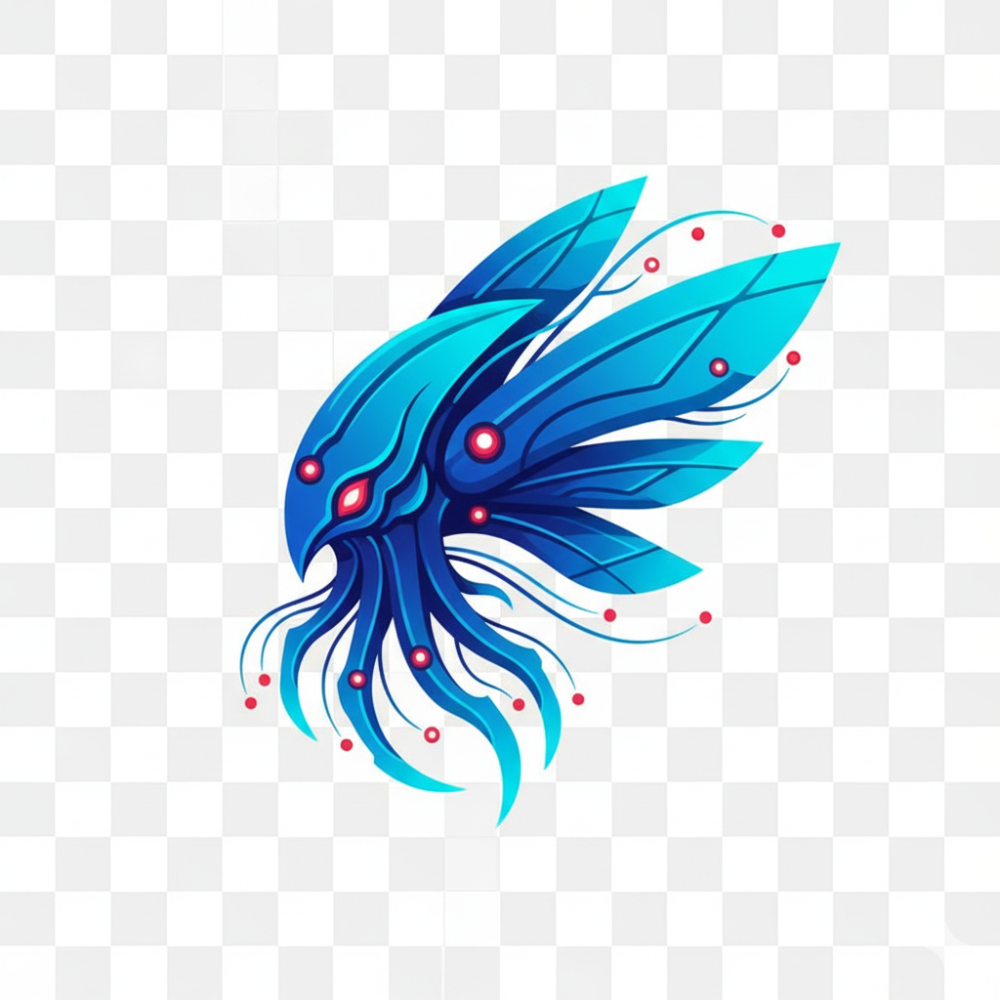

<p align="center">
  
</p>

<h1 align="center">Zerg</h1>

<p align="center">
  <strong>Visual AI workflow automation with real-time streaming.</strong>
</p>

Zerg combines chat-based AI agents, a visual workflow canvas, and per-token LLM streaming into a unified platform. Build automations where every visual node maps directly to runtime execution—not config files, not YAML, but a live canvas.

---

## 🏗️ Architecture

```
┌─────────────────────────────────────────────────────────────────┐
│                        React Dashboard                          │
│   ┌──────────────┐  ┌──────────────┐  ┌──────────────────────┐  │
│   │ Workflow     │  │ Agent        │  │ Execution            │  │
│   │ Canvas       │  │ Chat         │  │ Monitor              │  │
│   └──────────────┘  └──────────────┘  └──────────────────────┘  │
└─────────────────────────────────────────────────────────────────┘
                              │
                    WebSocket (per-token streaming)
                              │
┌─────────────────────────────────────────────────────────────────┐
│                      FastAPI Backend                            │
│  ┌────────────────┐  ┌────────────────┐  ┌──────────────────┐   │
│  │ LangGraph      │  │ Workflow       │  │ MCP              │   │
│  │ Agent Runner   │  │ Engine         │  │ Adapter          │   │
│  └────────────────┘  └────────────────┘  └──────────────────┘   │
│  ┌────────────────┐  ┌────────────────┐  ┌──────────────────┐   │
│  │ Credential     │  │ Topic-based    │  │ Trigger          │   │
│  │ Resolver       │  │ Pub/Sub        │  │ Service          │   │
│  └────────────────┘  └────────────────┘  └──────────────────┘   │
└─────────────────────────────────────────────────────────────────┘
                              │
              PostgreSQL + Encrypted Credential Store
```

---

## ✨ Key Features

### Visual Workflow Canvas
Drag-and-drop workflow builder with four node types:
- **Triggers** — Gmail, webhooks, cron schedules
- **Agents** — LangGraph-powered with tool access
- **Tools** — HTTP calls, math, containers, MCP tools
- **Conditionals** — Branch logic based on node outputs

Parallel execution is native. The StateGraph engine handles concurrent branches with typed reducers—no race conditions, no manual synchronization.

### Per-Token LLM Streaming
Every token streams over WebSocket as it's generated. The `WsTokenCallback` handler forwards chunks in real-time, so your UI updates character-by-character instead of waiting for complete responses.

```python
# Under the hood: async callback handler with context vars
class WsTokenCallback(AsyncCallbackHandler):
    async def on_llm_new_token(self, token: str, **kwargs):
        await topic_manager.publish(f"thread:{thread_id}", StreamChunkData(token))
```

### MCP Integration
First-class [Model Context Protocol](https://modelcontextprotocol.io/) support. Connect any MCP server or use built-in presets:

| Service | Capabilities |
|---------|-------------|
| GitHub | Issues, PRs, repos, code search |
| Slack | Messages, channels, threads |
| Linear | Issues, projects, cycles |
| Notion | Pages, databases, blocks |
| Custom | Any MCP-compliant server |

MCP tools coexist with built-in tools in a unified registry. The adapter handles connection pooling, retries (3× with 30s timeout), and HTTP/2 multiplexing.

### Two-Tier Credential Management
Enterprise-ready credential resolution:

1. **Account-level** — Shared org credentials (e.g., team Slack workspace)
2. **Agent-level** — Per-agent overrides for isolated secrets

Credentials resolve at runtime through a cascading lookup with Fernet encryption at rest.

### Jarvis Integration
Voice and device UI powered by the same backend. Jarvis is a PWA that dispatches to Zerg agents via device-secret authentication:

```
Jarvis PWA → Device Auth → JWT Session → Agent Dispatch → SSE Stream
```

One platform, multiple interfaces.

---

## ⚙️ Technical Highlights

**LangGraph Agent Execution**
- Functional ReAct agents compiled to async runnables
- Process-local cache with edit-based invalidation
- Full async execution—no blocking thread pools

**Workflow Engine** (~150 LOC)
- StateGraph with typed state and `Annotated` reducers
- Fail-fast semantics: `first_error` reducer halts on exception
- Envelope-based outputs with node metadata

**WebSocket Architecture**
- Topic-based pub/sub (`agent:123`, `thread:45`, `workflow:99`)
- JWT pre-authentication before handshake acceptance
- Custom close codes (4401 for invalid JWT)

**Trigger System**
- Gmail OAuth with push notifications via Cloud Pub/Sub
- Webhook endpoints with signature verification
- APScheduler for cron/interval jobs

---

## 🛠️ Stack

| Layer | Technology |
|-------|------------|
| Frontend | React, TypeScript, Vite |
| Backend | FastAPI, Python 3.12, LangGraph |
| Database | PostgreSQL (prod), SQLite (test) |
| Real-time | WebSocket with topic pub/sub |
| Auth | JWT, Google OAuth, device secrets |
| Tools | MCP protocol, built-in registry |
| Observability | LangSmith tracing (optional) |

---

## 📁 Project Structure

```
apps/
├── zerg/
│   ├── backend/        # FastAPI + LangGraph agents
│   ├── frontend-web/   # React dashboard
│   └── e2e/            # Playwright tests
└── jarvis/             # Voice/device PWA

config/                 # Environment configs
docker/                 # Docker Compose + Dockerfiles
docs/                   # Documentation + branding
schemas/                # OpenAPI, AsyncAPI, JSON schemas
scripts/                # Dev tools + generators
tests/                  # Integration tests
```

---

## License

ISC
